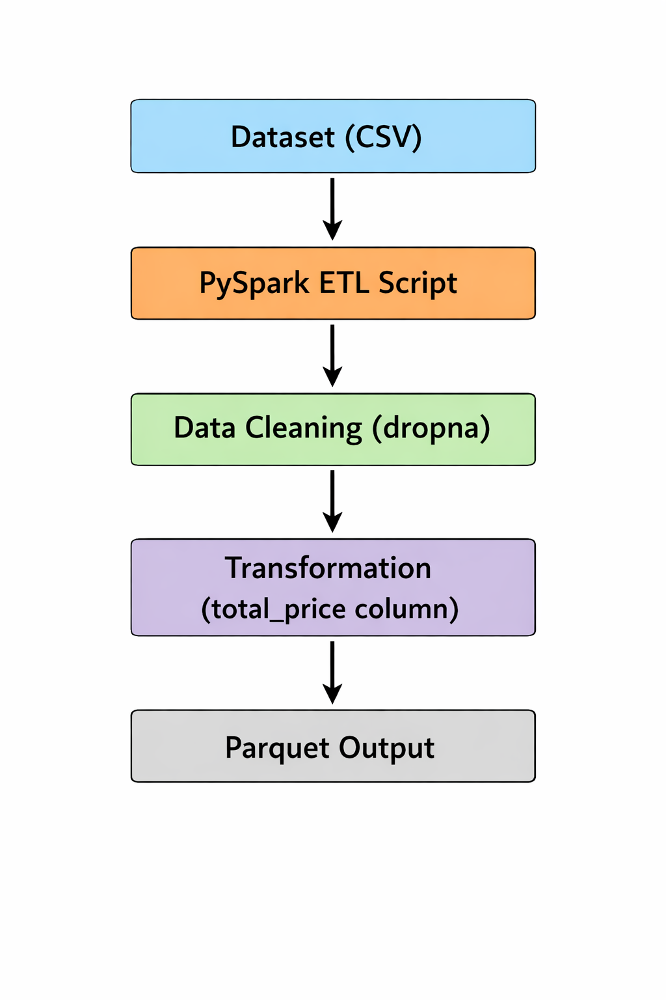

# ETL Pipeline Architecture

## Architecture Diagram

## Flow Description

Dataset (CSV)
      │
      ▼
PySpark ETL Script
      │
      ▼
Data Cleaning (dropna)
      │
      ▼
Transformation (total_price column)
      │
      ▼
Parquet Output
