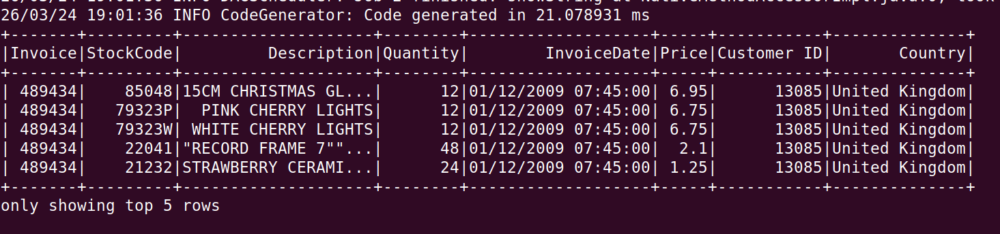
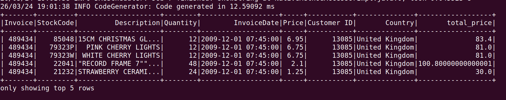

# ETL Data Pipeline using Python + Spark

## Project Overview
This project demonstrates an ETL pipeline using PySpark.

## Dataset
online_retail.csv

## Steps

### 1. Extract
Data extracted from CSV using Spark.

### 2. Transform
- Removed null values
- Created new column: total_price = Quantity * Price

### 3. Load
Transformed data stored in Parquet format.

## Raw Data

## Transformed Data

## Technologies Used
- Python
- PySpark
- Linux
- Parquet
